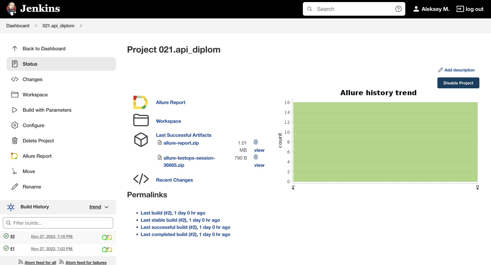
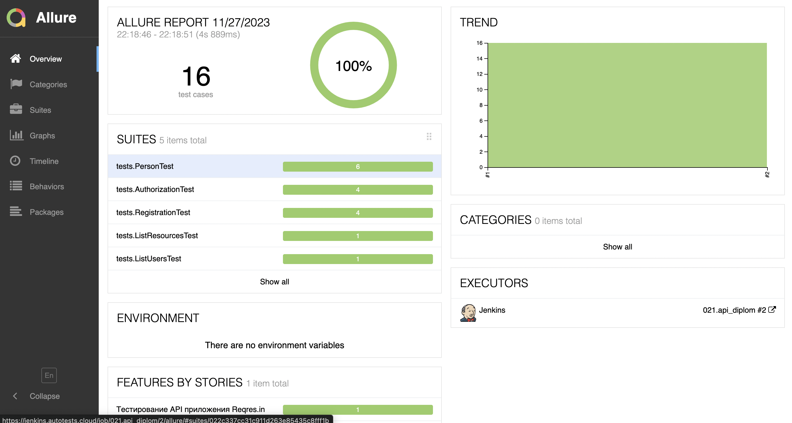
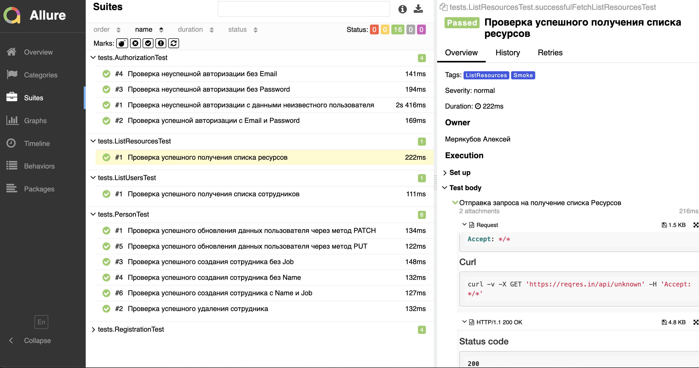
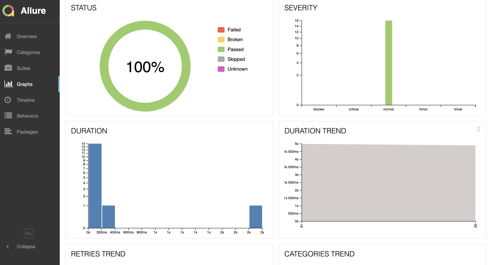
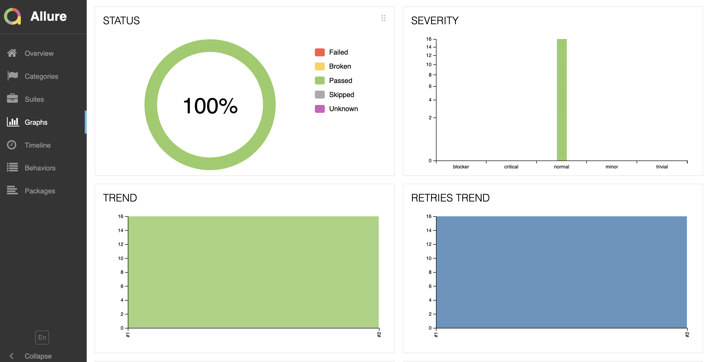
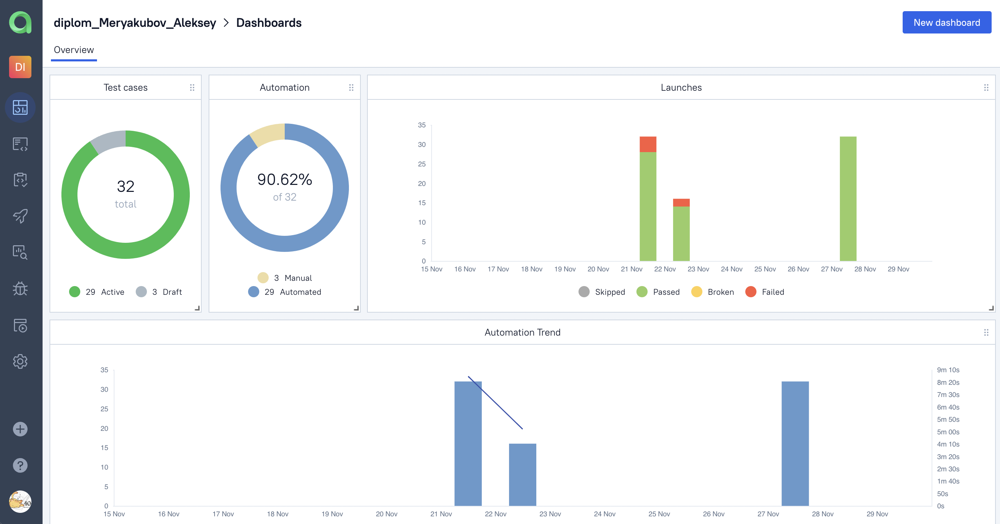
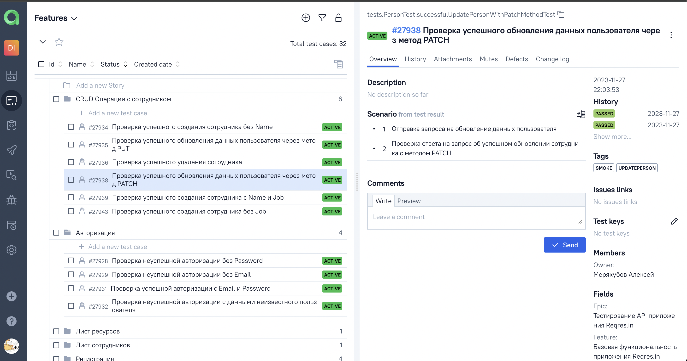
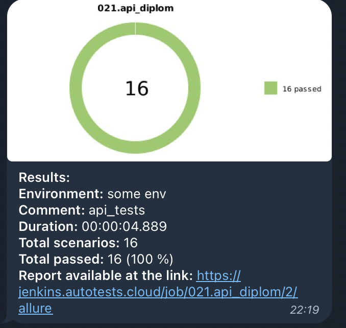

<h1 >Проект по автоматизации API тестирования сервиса <a href="https://reqres.in/ ">Reqres.in</a></h1>

<p align="center">  
</a>  
</p>

# 📝 Содержание:

- [Технологии и инструменты](#технологии-и-инструменты)
- [Реализованные проверки](#Реализованные-проверки)
- [Запуск тестов (Сборка в Jenkins и параметры)](#запуск-тестов-сборка-в-jenkins)
- [Запуск тестов (Из терминала)](#запуск-тестов-из-терминала)
- [Интеграция с Allure Report](#allure-report)
- [Интеграция с Allure TestOps](#интеграция-с-allure-testops)
- [Уведомление в Telegram о результатах выполнения автоматизированных тестов](#уведомление-в-telegram-о-результатах-выполнения-автоматизированных-тестов)

<a id="технологии-и-инструменты"></a>

## ☕ Стек:

| Java                                                                                                     | IntelliJ  <br>  Idea                                                                                               | GitHub                                                                                                     | JUnit 5                                                                                                           | Gradle                                                                                                     | RestAssured                                                                                                               | Allure <br> Report                                                                                                         | Jenkins                                                                                                          | Telegram                                                                                                            |                                                                                                 AllureTestOps |
|:---------------------------------------------------------------------------------------------------------|--------------------------------------------------------------------------------------------------------------------|------------------------------------------------------------------------------------------------------------|-------------------------------------------------------------------------------------------------------------------|------------------------------------------------------------------------------------------------------------|---------------------------------------------------------------------------------------------------------------------------|----------------------------------------------------------------------------------------------------------------------------|------------------------------------------------------------------------------------------------------------------|---------------------------------------------------------------------------------------------------------------------|--------------------------------------------------------------------------------------------------------------:|
| <a href="https://www.java.com/"></a> | <a href="https://www.jetbrains.com/idea/"></a> | <a href="https://github.com/"></a> | <a href="https://junit.org/junit5/"></a> | <a href="https://gradle.org/"></a> | <a href="https://rest-assured.io/"></a> | <a href="https://github.com/allure-framework"></a> | <a href="https://www.jenkins.io/"></a> | <a href="https://web.telegram.org/"></a> | <a href="https://qameta.io/"></a> |

В данном проекте автотесты написаны на **Java**. Для сборки проекта в
среде IntelliJ IDEA используется **Gradle**. **JUnit 5** задействован в качестве фреймворка модульного тестирования, а
**RestAssured** используется для тестирования API.
Запуск тестов выполняется из **Jenkins**, и вся работа по управлению проектом и отслеживанию задач выполняется с
использованием **Jira**. **Allure Report**, **AllureTestOps** и **Telegram Bot** используются для визуализации
результатов тестирования.

<a id="Реализованные-проверки"></a>

##  📠 Реализованные проверки:

### На авторизацию 

### На регистрацию

### Создание сотрудника

### Обновление сотрудника:

### Удаление сотрудника

### Список ресурсов

### Список пользователей

<a id="запуск-тестов-сборка-в-jenkins"></a>

##  Сборка в [Jenkins](https://jenkins.autotests.cloud/job/021.api_diplom/)

<p align="center">  
</a>  
</p>

## 🔧 Параметры сборки в Jenkins:

- _TASK (Задачи, по умолчанию Smoke_test)_

<a id="запуск-тестов-из-терминала"></a>

## ⚡  Команда для запуска автотестов из терминала

```bash  
gradle clean test 
```

<a id="allure-report"></a>

##  </a>Интеграция с <a target="_blank" href="https://jenkins.autotests.cloud/job/021.api_diplom/1/allure/">Allure Report</a>

## 📊 Основная страница отчёта

<p align="center">  
  
</p>  

## 🏈 Тест-кейсы

<p align="center">  
   
</p>

##  📈 Графики

<p align="center">   
  
  
</p>

<a id="интеграция-с-allure-testops"></a>

##  </a>Интеграция с <a target="_blank" href="https://allure.autotests.cloud/project/3809/dashboards">Allure TestOps</a>

## 📊 Основная страница отчёта

<p align="center">  
  
</p>  

## 📭 Автоматизированные тест-кейсы

<p align="center">  
  
</p>

____

<a id="уведомление-в-telegram-о-результатах-выполнения-автоматизированных-тестов"></a>

## </a> Уведомление в Telegram при помощи бота

____
<p align="center">  
  
</p>

____
